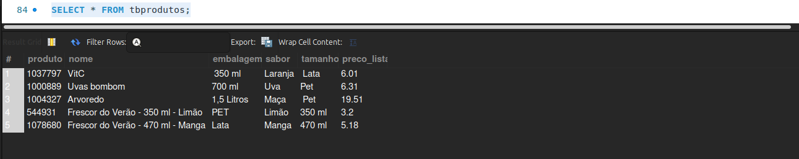
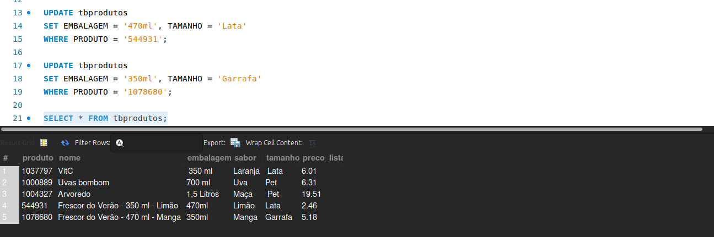

# 🔄 Atualizando Registros com SQL (`UPDATE`)

## 📥 Inserindo Dados para Teste

Primeiro, insira os dados abaixo na tabela `tbproduto`:

```sql
USE sucos;

INSERT INTO tbprodutos (
  PRODUTO, NOME, EMBALAGEM, TAMANHO, SABOR, PRECO_LISTA
) VALUES
('544931', 'Frescor do Verão - 350 ml - Limão', 'PET', '350 ml','Limão', 3.20),
('1078680', 'Frescor do Verão - 470 ml - Manga', 'Lata', '470 ml','Manga', 5.18);
```

<br>

## ✏️ Corrigindo Dados com `UPDATE`

Após revisar os dados inseridos, percebemos divergências em alguns campos. Vamos corrigi-los usando o comando `UPDATE`.

```sql
UPDATE tbprodutos
SET EMBALAGEM = '470ml',
WHERE PRODUTO = '1078680';

UPDATE tbprodutos
SET EMBALAGEM = '470ml', TAMANHO = 'Lata'
WHERE PRODUTO = '544931';
```


> 💡 O comando `UPDATE` precisa ser acompanhado de uma cláusula `WHERE`, preferencialmente utilizando um campo único como a chave primária.

## ⚠️ Erro de Safe Updates

Se aparecer um erro informando que a cláusula `WHERE` não contém uma chave primária:

1. Vá em **Edit > Preferences > SQL Editor**
2. Desmarque a opção:  
   `Safe Updates (rejects UPDATEs and DELETEs with no restrictions)`
3. Clique em **OK**
4. Reinicie o MySQL Workbench (vá em **File > Exit** e abra novamente)

## ✅ Verificando as Alterações

Execute:

```sql
SELECT * FROM tbprodutos;
```

<br>

As alterações nos produtos com códigos `544931` e `1078680` devem estar aplicadas.
