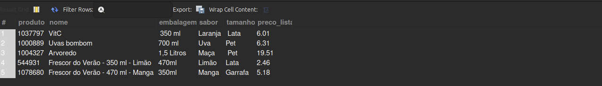

## Excluir registros de uma tabela no MySQL usando o comando `DELETE`.

### 1. Visualizando a tabela

Analisar os dados antes de excluir:

```sql
USE sucos;
SELECT * FROM tbprodutos;
```
<br>

### 2. Excluindo um registro específico

Excluindo o produto com código `1078680`:

```sql
DELETE FROM tbprodutos WHERE PRODUTO = '1078680';
```

⚠️ **Importante:**  
Sempre use a cláusula `WHERE` ao utilizar `DELETE`. Sem ela, todos os registros da tabela serão apagados.

> 💡 **Dica:**  
> `DROP` apaga **objetos** do banco (como tabelas ou bancos de dados).  
> `DELETE` apaga apenas **registros** dentro de uma tabela.

### 3. Verificando a exclusão

Use o comando novamente para verificar:

```sql
SELECT * FROM tbprodutos;
```
<br>