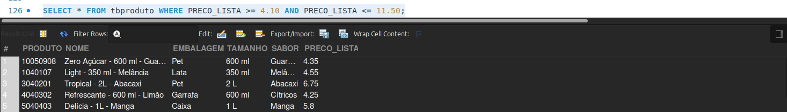
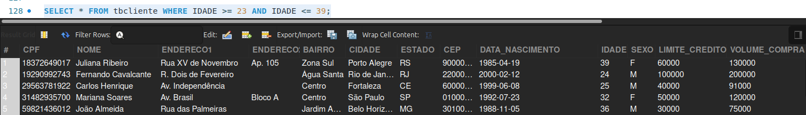
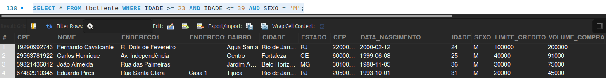
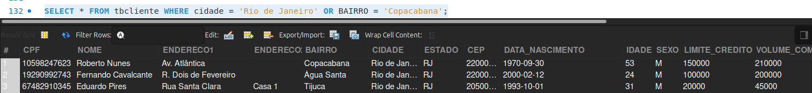
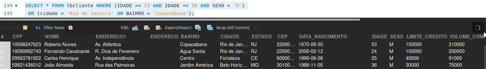

# Filtros compostos

> Até o momento vimos sobre filtros simples, quando queremos analisar os registros iguais, maior ou menor a algum dado indicado. Nessa aula vamos aprender a realizar filtros compostos, quando queremos juntar duas condições em uma só.
> 

Selecionando a tabela de produtos com o comando:

```sql
SELECT * FROM tbproduto;
```
Observe a coluna "PRECO_LISTA", que aplicamos a condição `BETWEEN` em aulas passadas.

Quando usamos o comando `BETWEEN` (entre) já estávamos aprendendo mais ou menos sobre como funciona o filtro composto, visto que quando inserimos essa cláusula estamos impondo a seguinte condição: me retorne todos os registros que são maiores ou iguais ao valor indicado primeiro e menores ou iguais a outro valor especificado.

No caso anterior, usamos `SELECT * FROM tbproduto WHERE PRECO_LISTA BETWEEN 4.10 AND 11.50;`, esse comando significa que será executado primeiro a condição `SELECT * FROM tbproduto WHERE PRECO_LISTA >= 4.10;` e sobre o resultado desse comando, aplicar a segunda condição `SELECT * FROM tbproduto WHERE PRECO_LISTA <= 11.50;`. Esta última, quando a executamos é aplicada sobre tudo, de forma separada.

```sql
SELECT * FROM tbproduto WHERE PRECO_LISTA BETWEEN 4.10 AND 11.50;;
SELECT * FROM tbproduto WHERE PRECO_LISTA >= 4.10;
SELECT * FROM tbproduto WHERE PRECO_LISTA <= 11.50;;
```

Para juntar as condições vamos usar o filtro `AND` ("E"):

```sql
SELECT * FROM tbproduto WHERE PRECO_LISTA >= 4.10 AND PRECO_LISTA <= 11.50;
```
Com esse comando ambas condições serão realizadas simultaneamente, no mesmo `WHERE`. Rodando essa linha de código teremos o mesmo resultado de quando aplicamos o `BETWEEN`:

<br>


Podemos usar essa condição em diversas situações, como, por exemplo, se quisermos buscar somente clientes que tenham entre 23 e 39 anos. Vamos selecionar a tabela de cliente e inserir a condição: 

```sql
SELECT * FROM tbcliente WHERE IDADE >= 23 AND IDADE <= 39;

```
<br>

<br>

É possível também incluir mais condições no comando, vamos selecionar quem tem entre 23 e 39 anos **e** são do sexo masculino: 

```sql
SELECT * FROM tbcliente WHERE IDADE >= 23 AND IDADE <= 39 AND SEXO = 'M';
```
Perceba que no `AND` é viável aplicarmos condições sobre campos diferentes conjuntamente.

<br>

<br>

Outra condição é o `OR` ("OU"), que pode ser usado em situações em que quero buscar clientes que moram no Rio de Janeiro **ou** no bairro Jardins em São Paulo simultaneamente, por exemplo:
 
```sql
SELECT * FROM tbcliente WHERE cidade = 'Rio de Janeiro' OR BAIRRO = 'Copacabana';
```

<br>

Conseguimos também juntar às duas condições em um só comando, vamos supor que queremos buscar os clientes entre 23 e 39 anos que são do sexo masculino **ou** da cidade do Rio de Janeiro, **ou** do bairro Copacabana.

> Uma boa prática ao escrever o código é usar os parênteses para isolar as condições.
> 

```sql
SELECT * FROM tbcliente WHERE (IDADE >= 23 AND IDADE <= 39 AND SEXO = 'M')
 OR (cidade = 'Rio de Janeiro' OR BAIRRO = 'Copacabana');
```
<br>


Então, o programa vai realizar a seleção do comando `WHERE` concatenando (encadeando em uma sequência lógica) várias condições usando `AND` e `OR`.

O resultado dessa consulta serão clientes entre 23 e 39 anos, do sexo masculino (primeira condição) e os que têm menos ou mais satisfazem a segunda condição, são do Rio de Janeiro **ou** do Bairro Copacabana.

> Um ponto relevante para comentar é que todas as condições que estamos aplicando na cláusula `WHERE` podemos usar também nos comandos `DELETE` e `UPDATE` também.
> 

