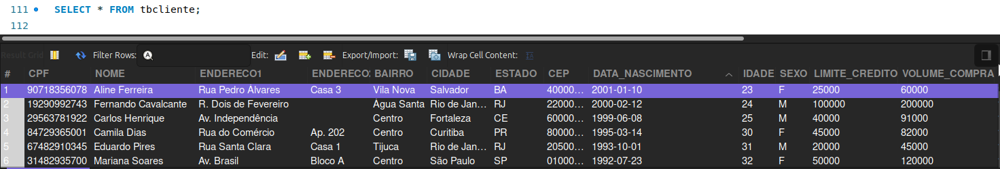
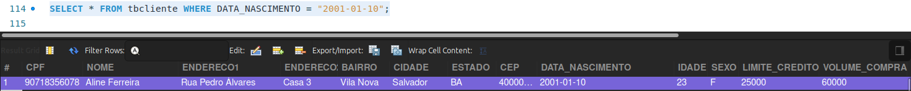
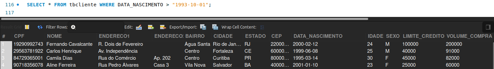
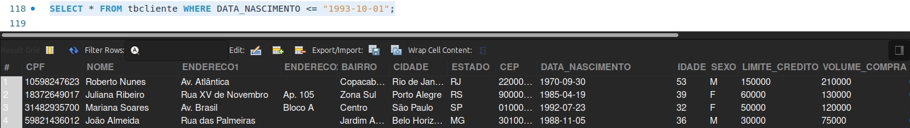
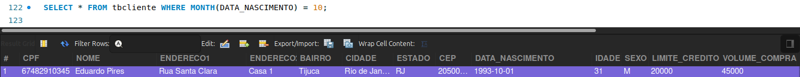

# Filtrando datas

## 🎯 Comportamento do MySQL quando queremos filtrar campos que são datas.

Abrindo um *script* no Workbench e selecionando a tabela de clientes com:

```sql
SELECT * FROM tbcliente;
```
Temos a coluna "DATA_NASCIMENTO", sendo a que vamos usar para realizar os testes de filtro.

<br>

Podemos especificar uma data, para saber quem nasceu nesse dia usando o comando `SELECT` e uma condição com o símbolo de igual `(=)`

```sql
SELECT * FROM tbcliente WHERE DATA_NASCIMENTO = "2001-01-10";;
```
<br>

O resultado dessa consulta é somente os clientes que nasceram no dia `2001-01-10`, que no caso é o Aline Ferreira.

<br>

Com datas também é possível usar o símbolo maior `(>)` e o menor `(<)`, sendo quem nasceu depois e antes do dia indicado, respectivamente.

```sql
SELECT * FROM tbcliente WHERE DATA_NASCIMENTO > "1993-10-01";
```
<br>

```sql
SELECT * FROM tbcliente WHERE DATA_NASCIMENTO <= "1993-10-01";
```
<br>

Perceba que nesse comando há o sinal de **menor ou igual**, isto é, a data indicada está incluída no filtro e será exibida no resultado da consulta.

<br>

As datas se comportam de forma semelhante aos números na aplicação de filtros, contudo é utilizado o calendário ocidental para ordenar as datas. Pode também manusear partes das datas, como apenas o ano ou o mês, visto que há funções de data que nos auxiliam nisso. Por exemplo:

```sql
SELECT * FROM tbcliente WHERE YEAR(DATA_NASCIMENTO) = 1995;
```
Sendo `YEAR()` uma função que filtra o ano de uma data especificada no parêntese, o resultado dessa função é um número inteiro e, em razão disso, o ano **1995** não está entre aspas simples `('')`.

<br>

<br>

Em situações que queremos filtrar apenas o mês, como em alguma campanha de marketing em que será enviado um cartão de celebração para quem faz aniversário em um determinado mês de outubro (`10`), por exemplo: 

```sql
SELECT * FROM tbcliente WHERE MONTH(DATA_NASCIMENTO) = 10;
```


O resultado dessa consulta é 1 registro com os clientes que fazem aniversário no mês de outubro.

<br>


🎯 Resumindo, podemos usar a função YEAR e MONTH para inserir anos e meses no filtro e as datas se comportam como números para essas condições. O MySQL considera o calendário interno, sabendo, por exemplo, que o **1-01-1995** vem antes de **31-12-1998**, isto é, ele já possui esse controle interno das datas.

