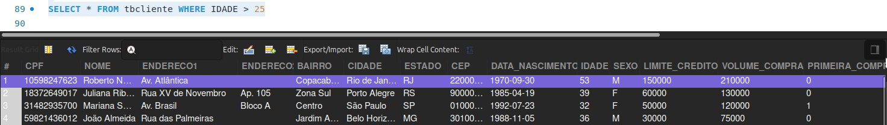
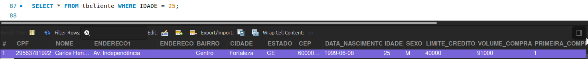
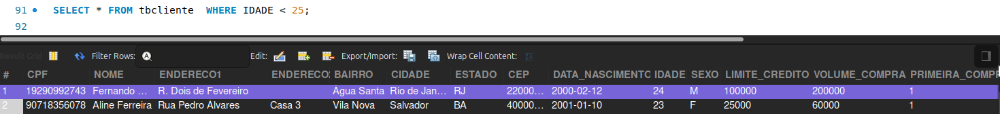
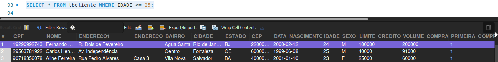
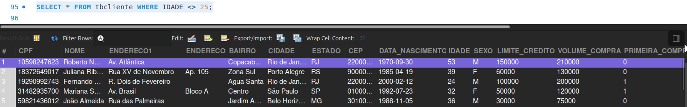
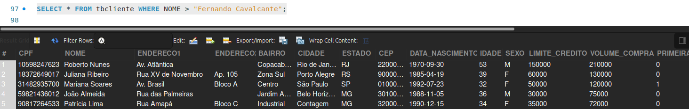
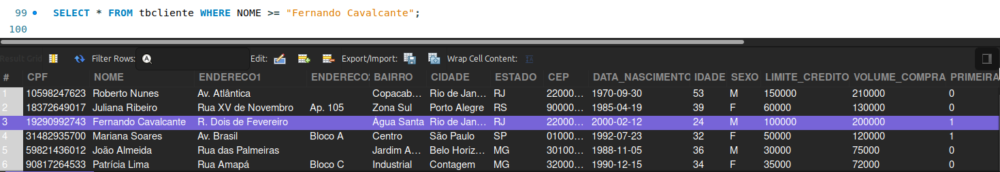
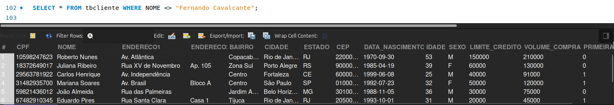
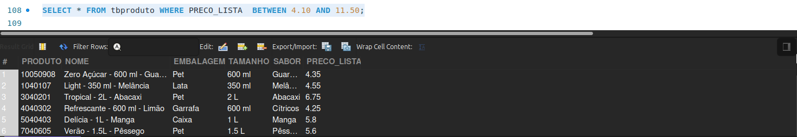

# Filtrando usando maior, menor e diferente

🎯  Buscar registros maiores ou menores sobre algum dado.

Selecionando clientes que possuem idade **exata** de 25 anos:

```sql
 SELECT * FROM tbcliente WHERE IDADE = 25;
```

<br>


Podemos também selecionar clientes que tem **mais** de 25 anos, substituindo o igual `(=)`" por maior `(>)` no comando: 

```sql
SELECT * FROM tbcliente WHERE IDADE > 25;
```

<br>


Para selecionar clientes com **menos** de 25 anos, basta substituir o maior `(>)` por menor `(<)` no comando: 
```sql
SELECT * FROM tbcliente WHERE IDADE < 25;
```

<br>


Vamos consultar agora clientes que têm **menos** de 25 anos, **incluindo** os que têm. Basta substituir o menor `(<)` por menor ou igual `(<=)` no comando: 

```sql
SELECT * FROM tbcliente WHERE IDADE <= 25;

```
<br>


Supondo que agora precisamos consultar todos os clientes, exceto os que têm 25 anos. Basta substituir pelo símbolo de diferença no comando `(<>)`: 

```sql
SELECT * FROM tbcliente WHERE IDADE <> 25;
```
<br>

<br>

🎯  Filtrando ***TEXTOS***
> Podemos aplicar esses símbolos de menor, maior, menor ou igual, ou maior ou igual em textos também. No MySQL existe uma ordem alfabética para as letras, então, o **"B"** é maior que o **"A"** (B > A), o **"C"** é maior que o **"B"** (C > B), o **"X"** é maior que **"R"** e assim sucessivamente.
> 

Por isso, quando realizamos a consulta 
```sql
SELECT * FROM tbcliente WHERE NOME > "Fernando Cavalcante";
```
 o MySQL analisa a primeira letra, no caso **"F"**, a partir desse critério e se tiver outro nome que inicie com **"F"**, como "Fátima" seria um candidato, já ao comparar a segunda letra de cada nome, perceberia que **"E"** é maior que **"A"**, descartando "Fátima" da condição.

O resultado dessa consulta são clientes com nomes "acima" da letra **"F"**, como **M**ariana, **P**atricia.

<br>


Se quisermos incluir o Fernando na consulta, teríamos que colocar o símbolo maior ou igual `(>=)` no comando:

```sql
SELECT * FROM tbcliente WHERE NOME >= "Fernando Cavalcante";
```

<br>


Para excluir o nome "Fernando" do filtro, usamos o símbolo de diferente `(<>)`: 

```sql
SELECT * FROM tbcliente WHERE NOME <> "Fernando Cavalcante";
```

<br>


🎯  Comando ***BETWEEN***

Tem um detalhe que vamos ver agora que pode gerar algumas dúvidas. Ao executar o comando
```sql
SELECT * FROM tbproduto WHERE PRECO_LISTA = 4.10;
```
o resultado é vazio, isso acontece pelo fato do campo "PRECO_LISTA" ser do tipo FLOAT, um ponto flutuante e, em razão disso, não é possível encontrar exatamente o resultado inserido na condição.

| **PRODUTO** | **NOME** | **EMBALAGEM** | **TAMANHO** | **SABOR** | **PRECO_LISTA** |
| --- | --- | --- | --- | --- | --- |
| NULL | NULL | NULL | NULL | NULL | NULL |

O recomendado para trabalhar com condições de igual `(=)`, menor ou igual `(<=)` ou, maior ou igual `(>=)` e diferente `(<>)` seria o tipo DECIMAL, visto que o MySQL consegue encontrar o número exato na busca.

Para números do tipo FLOAT, é possível usar apenas os símbolos de maior e menor, podemos usar o diferente `(<>)`, porém o produto com o preço `16.008` também irá constar justamente pelo fato do MySQL não encontrar o valor exato.

Temos o comando ***BETWEEN***, que é mais elaborado que o WHERE. Com ele conseguimos buscar exatamente o valor especificado na condição usando o comando:

```sql
SELECT * FROM tbproduto WHERE PRECO_LISTA  BETWEEN 4.10 AND 11.50;

```
<br>


Essa é uma característica do MySQL, por ser do tipo FLOAT não é possível buscar o valor exato. Porém, podemos usar os limites inferiores e superiores próximos para conseguir encontrar o valor que queremos.

