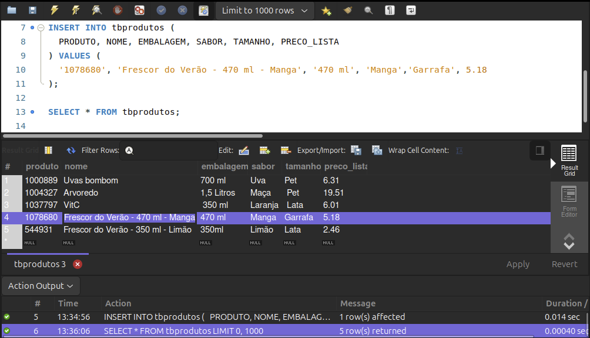
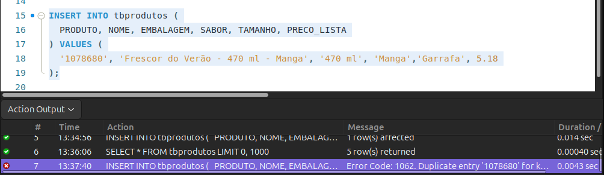

# 📘 **Documentação – Incluindo a Chave Primária em Tabelas MySQL**

## 🧩 1. Por que usar uma chave primária?

Ao executar um comando `UPDATE`, o MySQL pode retornar um erro se a cláusula `WHERE` não utilizar uma chave primária ou um campo que garanta a unicidade dos registros.  
Isso acontece principalmente se a opção **Safe Updates** estiver habilitada em:

```
Preferences > SQL Editor > Safe Updates
```

Mas mais importante que isso: **ter uma chave primária evita que registros duplicados sejam inseridos na tabela**.

Na tabela `tbprodutos`, o campo `PRODUTO` (código interno do produto) é único e deve ser usado como **chave primária**, pois produtos podem ter descrições iguais, mas não códigos iguais.

---

## 🛠️ 2. Adicionando a chave primária

Se a chave primária não foi definida na criação da tabela, é possível adicioná-la posteriormente com o comando `ALTER TABLE`.

```sql
USE sucos;

ALTER TABLE tbprodutos ADD PRIMARY KEY (PRODUTO);
```

> 💡 Poderíamos ter definido a chave primária já no `CREATE TABLE`, mas aqui vamos aprender a fazer isso com a tabela já criada.

---

## 🧪 3. Testando a inserção de registros

Vamos inserir novamente um produto que foi excluído anteriormente (`1078680`):

```sql
INSERT INTO tbprodutos (
  PRODUTO, NOME, EMBALAGEM, SABOR, TAMANHO, PRECO_LISTA
) VALUES (
  '1078680', 'Frescor do Verão - 470 ml - Manga', '470 ml', 'Manga','Garrafa', 5.18
);
```

Em seguida, execute:

```sql
SELECT * FROM tbprodutos;
```

Você verá o produto `1078680` inserido com sucesso.

<br>

---

## ❌ 4. O que acontece ao tentar inserir um código repetido?

Vamos tentar novamente inserir o produto `1078680`. O comando:

```sql
INSERT INTO tbprodutos (
  PRODUTO, NOME, EMBALAGEM, SABOR, TAMANHO, PRECO_LISTA
) VALUES (
  '1078680', 'Frescor do Verão - 470 ml - Manga', '470 ml', 'Manga','Garrafa', 5.18
);
```

Retorna o erro:

> **Error Code: 1062. Duplicate entry '1078680' for key 'PRIMARY'**

✅ Isso confirma que **a chave primária está funcionando corretamente**, impedindo registros duplicados com o mesmo código.


<br>

---


## ✅ 6. Conclusão

- A **chave primária** é essencial para garantir a integridade dos dados.
- Ela evita que registros com o mesmo identificador sejam inseridos.
- É uma boa prática sempre definir a chave primária no momento da criação da tabela (`CREATE TABLE`) ou posteriormente com `ALTER TABLE`.