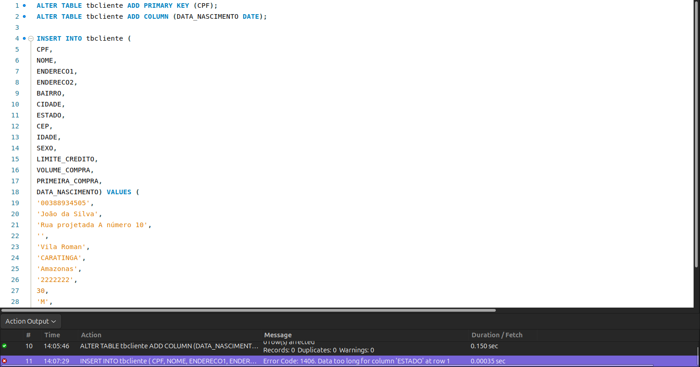
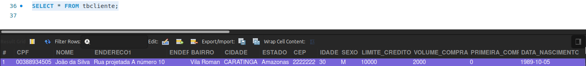
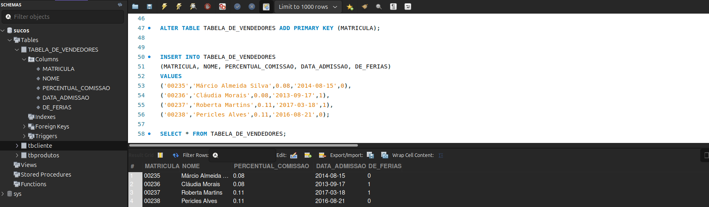

# Manipulando Campos do Tipo Lógico e Data no MySQL

Tipo **lógico** e o tipo **data**, usando a tabela `tbcliente`.

## Adicionando Chave Primária e Campo de Data

1. Tornar o campo `CPF` a chave primária.
2. Adicionar o campo `DATA_NASCIMENTO` do tipo `DATE`.

```sql
USE sucos;

ALTER TABLE tbcliente ADD PRIMARY KEY (CPF);

ALTER TABLE tbcliente ADD COLUMN (DATA_NASCIMENTO DATE);
```

> Após rodar os comandos acima, clique com o botão direito em "Columns" e escolha a opção "*Refresh All*" para visualizar o novo campo.

## Inserindo um Registro com Campos Lógicos e de Data

```sql
INSERT INTO tbcliente (
CPF,
NOME,
ENDERECO1,
ENDERECO2,
BAIRRO,
CIDADE,
ESTADO,
CEP,
IDADE,
SEXO,
LIMITE_CREDITO,
VOLUME_COMPRA,
PRIMEIRA_COMPRA,
DATA_NASCIMENTO) VALUES (
'00388934505',
'João da Silva',
'Rua projetada A número 10',
'',
'Vila Roman',
'CARATINGA',
'Amazonas',
'2222222',
30,
'M',
10000.00,
2000,
0,
'1989-10-05');
```
## ❌ 4. Error Code: 1406. Data too long for column 'ESTADO' at row 1

<br>

> ⚠️ O campo `ESTADO` estava originalmente limitado a 2 caracteres. Para ajustar:

```sql
ALTER TABLE tbcliente MODIFY ESTADO varchar(60);
```
Após executar a modificação do campo ESTADO Rode a inserção novamente.


## Verificando o Registro Inserido

```sql
SELECT * FROM tbcliente;
```

### Resultado Esperado

<br>


## Exercício: Manipulando Tabela de Vendedores

### Objetivo

Criar campos `DATA_ADMISSAO` e `DE_FERIAS` na tabela de vendedores.

### Passos

1. Apague a tabela existente.
2. Recrie a tabela com os novos campos.
3. Crie a chave primária.
4. Insira os dados.

### Script de Resolução

```sql
DROP TABLE TABELA_DE_VENDEDORES;
```

```sql
CREATE TABLE TABELA_DE_VENDEDORES
( MATRICULA varchar(5),
  NOME varchar(100),
  PERCENTUAL_COMISSAO float,
  DATA_ADMISSAO date,
  DE_FERIAS bit);
```

```sql
ALTER TABLE TABELA_DE_VENDEDORES ADD PRIMARY KEY (MATRICULA);
```

```sql
INSERT INTO TABELA_DE_VENDEDORES
(MATRICULA, NOME, PERCENTUAL_COMISSAO, DATA_ADMISSAO, DE_FERIAS)
VALUES
('00235','Márcio Almeida Silva',0.08,'2014-08-15',0),
('00236','Cláudia Morais',0.08,'2013-09-17',1),
('00237','Roberta Martins',0.11,'2017-03-18',1),
('00238','Pericles Alves',0.11,'2016-08-21',0);
```
```sql
 SELECT * FROM TABELA_DE_VENDEDORES;
```
<br>

---

> Com isso, aprendemos a manipular dados lógicos (`BIT`) e campos de data (`DATE`) no MySQL.