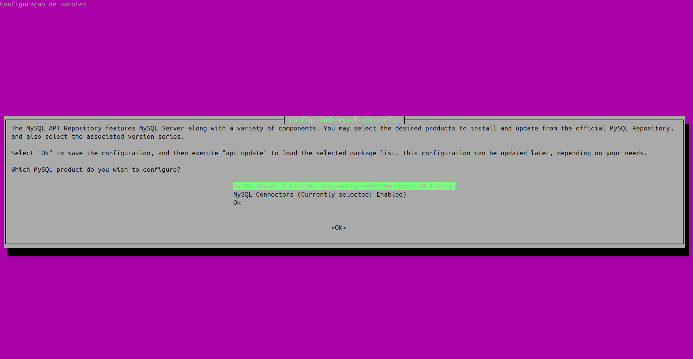

# Instalação e Configuração do MySQL server no Linux(Ubuntu)

## 1. Baixar versão
Verificar versão: https://dev.mysql.com/downloads/repo/apt/

#### Entre no terminal, copie e cole os comandos abaixo:

```bash
wget -c https://repo.mysql.com//mysql-apt-config_0.8.33-1_all.deb
```
```bash
ENTER
```
<br>

## 2. Instalar o pacote do repositório MySQL
```bash
sudo dpkg -i mysql-apt-config_0.8.33-1_all.deb
```
```bash
ENTER
```
Ele abrirá um configurador do mysql: 
- Ele pedirá qual produto mysql queremos configurar.
- Ele vem por padrão o que queremos que é o (server & cluster) então é só descer até o último "OK"

<br>

```bash
🔹Com a SETA do seu teclado desça até o OK 
🔹TAB para ir para o último Ok 
🔹ENTER
```

<br>

Após essa seleção (OK) ele baixará o pacote do repositório: 

<br>

Atualize as listas dos repositórios do linux, para ele saber onde encontrar e baixar os pacotes para fazer a instalação.

```bash
sudo apt-get update
```
<br>
Repare que ele baixou os REPO do mysql.

## 3. Instalar o MySQL 

```bash
sudo apt install mysql-server
```

```bash
🔹Adicione sua SENHA de usuario linux.
🔹ENTER
🔹Digite S para continuar
```

<br>

Será solicitada uma senha de root para o MySQL. Crie uma senha (diferente da senha root do Linux).

```bash
🔹Digite uma SENHA.
🔹TAB para descer até o OK
🔹ENTER
```
<br>

Confirme a senha

```bash
🔹Digite a SENHA criada anteriormente.
🔹TAB para descer até o OK
🔹ENTER

```
<br>

Aguarde a instalação.

<br>

Instalação finalizada:

<br>

## 4. Configuração segura do MySQL

```bash
sudo mysql_secure_installation
```
```bash
🔹Adicione sua SENHA de usuario linux.
🔹ENTER
🔹Adicione a sua SENHA do mysql criada anteriormente
🔹ENTER
```
Obs: a senha não irá aparecer enquanto você digita.

<br>

```bash
🔹O instalador do MySQL pedirá se deseja configurar o VALIDATE PASSWORD COMPONENT
🔹caso SIM, digite Y
🔹caso NÃO digite qualquer outra tecla.
```
Nota: VALIDATE PASSWORD COMPONENT: recurso que verifica a força das senhas para garantir maior segurança no banco de dados.
Se não deseja alterar sua senha criada anteriormente digite qualquer outra tecla.

```bash
🔹O instalador do MySQL pedirá se deseja continuar com a senha atual
🔹Se sua senha atual for fraca ou você desejar mais segurança: Pressione Y e siga os próximos passos para criar uma nova senha.
🔹Se estiver satisfeito com a senha atual: Pressione qualquer outra tecla e siga em frente com a instalação.
```

Nota: Uma senha forte é sempre recomendada, especialmente em ambientes de produção. Idealmente, use uma senha com pelo menos 12 caracteres, misturando letras maiúsculas, minúsculas, números e símbolos.

Após isso o instalador informará que, por padrão, a instalação do MySQL cria um usuário anônimo que pode acessar o banco de dados sem autenticação. Esse recurso é útil para testes, mas pode representar um risco de segurança em um ambiente de produção.

```bash
🔹Digite Y para remover usuários anônimos e aumentar a segurança.
🔹ENTER
🔹OU Pressione qualquer outra tecla para mantê-los (não recomendado).
```


Após isso, desabilite o Login Remoto do Root, o instalador pergunta se você deseja impedir que o root acesse o MySQL remotamente.

```bash
🔹Digite Y para desabilitar o login remoto, garantindo maior segurança.
🔹ENTER
🔹OU Pressione qualquer outra tecla para permitir login remoto (não recomendado).
```
Nota: Para acesso remoto, crie outro usuário com permissões específicas. Desabilitar o login remoto reduz riscos de invasão.


Após isso,remova o Banco de Dados de Teste, o instalador pergunta se você deseja remover o banco de dados test, que é criado por padrão e acessível a qualquer usuário.

```bash
🔹Digite Y para remover o banco de dados de teste e aumentar a segurança.
🔹ENTER
🔹OU Pressione qualquer outra tecla se precisar manter o banco para testes controlados.
```
Nota: Remover o banco de teste é uma boa prática de segurança, mesmo em ambientes de desenvolvimento, para evitar confusão ou acessos desnecessários.


Após isso, recarregue as Tabelas de Privilégios, o instalador pergunta se você deseja recarregar as tabelas de privilégios para aplicar as alterações de segurança feitas.

```bash
🔹Digite Y para recarregar imediatamente e aplicar as mudanças sem reiniciar o MySQL.
🔹ENTER
🔹OU Pressione qualquer outra tecla se preferir recarregar mais tarde (não recomendado).
```
Nota: Recarregar as tabelas é o passo final para garantir que as alterações de segurança sejam aplicadas corretamente.

Após isso ele nos indicará All done, como sucesso.

<br>

## 5. Verificar se o serviço MySQL está ativo (em execução) ou inativo (parado).
Exibir o status do serviço MySQL no sistema, permitindo verificar se o MySQL está em execução ou se há algum problema.

```bash
sudo systemctl status mysql
```

<br>


## 6. Habilitar o serviço MySQL para iniciar automaticamente sempre que o sistema for reiniciado.

```bash
sudo systemctl enable mysql
```
<br><br><br>

# Instalação e Configuração do MySQL Workbench no Linux(Ubuntu):

Atualize os pacotes:

```bash
sudo apt update && sudo apt dist-upgrade -y
```

```bash
🔹sudo apt update: Atualiza a lista de pacotes disponíveis nos repositórios, garantindo que o sistema tenha informações atualizadas sobre pacotes e versões.
🔹sudo apt dist-upgrade -y: Atualiza os pacotes instalados para suas versões mais recentes e resolve dependências, instalando ou removendo pacotes conforme necessário. A opção -y aplica as mudanças automaticamente, sem solicitar confirmação.
```

Baixe o pacote .deb do MySQL Workbench, acesse o site oficial do MySQL e baixe a versão mais recente do MySQL Workbench para o seu sistema.
Copie essa parte (mysql-workbench-community_8.0.40-1ubuntu20.04_amd64.deb). e adicione no código abaixo junto ao comando:

```bash
wget http://cdn.mysql.com/Downloads/MySQLGUITools/mysql-workbench-community_8.0.40-1ubuntu24.04_amd64.deb -O mysql-workbench-community.deb

```

Após o download, instale o MySQL Workbench executando o comando abaixo:

```bash
sudo dpkg -i mysql-workbench-community.deb

```
Caso você tenha usado dpkg e encontrado o erro de dependências, pode usar o comando abaixo para corrigir as dependências faltantes:

```bash
sudo apt-get install -f
```
Após instalar as dependências, tente novamente instalar o MySQL Workbench:

```bash
sudo dpkg -i mysql-workbench-community.deb
```
<br>

Após isso, localize o aplicativo MySQL Workbench:

Clique em `Local instance`, ele abrirá a tela para `connectar`, coloque sua `senha do root` do mysql.

<br>

Após isso, já pode usar essa ferramenta para interagir com o MySQL.

<br>


<br><br><br>

## MySQL Server e MySQL Workbench: 

### Para que servem?

* **MySQL Server:**
    * Armazena dados de forma organizada em tabelas.
    * Permite buscar, inserir, atualizar e excluir dados.
    * Garante a integridade e a segurança dos dados.

* **MySQL Workbench:**
    * Cria e edita bancos de dados.
    * Desenvolve consultas SQL (Structured Query Language) para manipular os dados.
    * Visualiza os dados de forma gráfica.
    * Gerencia usuários e permissões.
    * Faz backups e restaurações.

### Um exemplo prático
Imagine que você quer criar um banco de dados para uma loja de livros. O MySQL Server seria o local onde você armazenaria as informações sobre os livros, como título, autor, preço e quantidade em estoque. O MySQL Workbench seria a ferramenta que você usaria para criar as tabelas (livros, autores), inserir os dados dos livros e realizar consultas, como "Quais livros do autor X estão em estoque?".

### Em resumo
* **MySQL Server:** É o coração do banco de dados, onde os dados são armazenados.
* **MySQL Workbench:** É a ferramenta que você usa para interagir com o banco de dados, facilitando a criação, manutenção e consulta dos dados.


